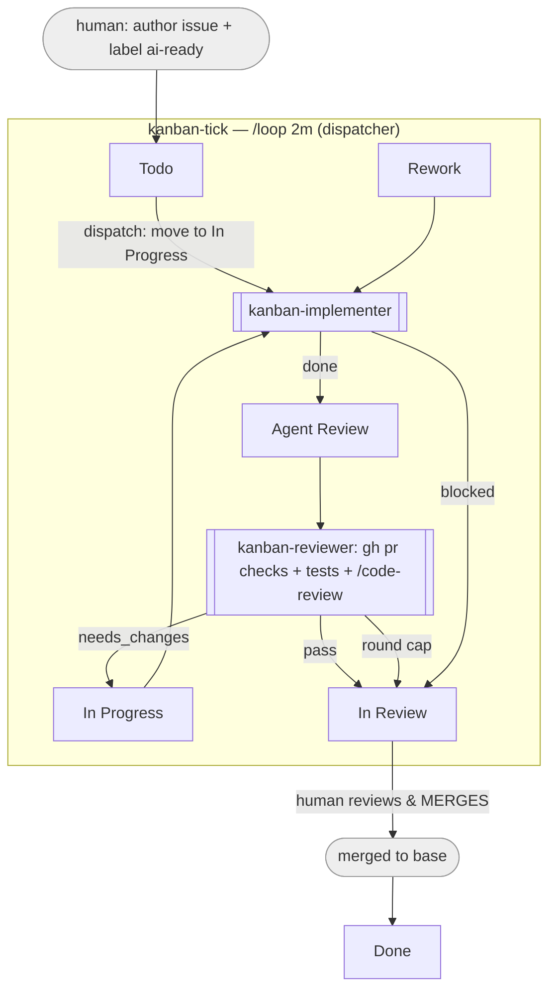

# kanban-loop

A Claude Code plugin that turns a GitHub Projects v2 board into a
self-running, loop-engineered development loop.

## 1. What it is

kanban-loop drives a GitHub Projects v2 board as a self-running development
loop from a single **resident Claude Code session** — the *dispatcher* —
running `/loop 2m /kanban-tick` in a workspace root directory. Each tick polls
the board, dispatches per-issue subagents in the background, collects finished
subagent results on the following tick, moves issue statuses, and enforces
hard safety caps.

The dispatcher is the **only** writer of board Status and `state.json`.
Subagents are pure workers: they receive an issue reference and a mode, do
the work, and return a single structured JSON object as their final message.
They never touch the board or state directly. **PRs are never auto-merged.**
The terminal state of every successful pass is the `In Review` column — a
human always makes the merge decision.

### Architecture



The dispatcher (`/loop 2m /kanban-tick`) is the only writer of board Status
and `state.json`; the two subagents are pure workers that return a JSON
result. Nothing is ever auto-merged — every path ends at `In Review`, where a
human decides.

### The five moves

| Move | Where it lives in kanban-loop |
|------|-------------------------------|
| **Discovery** | `kanban-tick` polls the board with one GraphQL query (items whose Status is in a watched column AND that carry the `ai-ready` label). |
| **Handoff** | `kanban-tick` dispatches background subagents (`kanban-implementer` / `kanban-reviewer`) with a compact prompt (issue ref + mode). The subagent's structured JSON result is the handoff back. |
| **Verification** | Generator/evaluator separation. `kanban-implementer` writes code; the independent read-only `kanban-reviewer` runs `gh pr checks` + the project test suite + `/code-review` before issuing a verdict. |
| **Persistence** | All cross-turn state is on disk in `state.json` (workspace root), never in the conversation window. Per-issue git workspaces persist code between passes. |
| **Scheduling** | `/loop 2m /kanban-tick` drives recurring ticks. Subagent completions arrive as notifications between ticks; the next tick reconciles them. |

### The six parts

| Part | Usage |
|------|-------|
| **Automations** | The `/loop` scheduler running `/kanban-tick`. |
| **Worktrees / isolated dirs** | Per-issue shallow clones under `workspaceRoot`. Implementer and reviewer never share a directory. |
| **Skills** | `kanban-tick`, `kanban-implement`, `kanban-review` (each ends with a `Stop` section). |
| **Connectors** | `gh` CLI (GraphQL + REST) for board, PRs, checks, review threads. |
| **Sub-agents** | `kanban-implementer` (read/write), `kanban-reviewer` (read-only). |
| **Memory** | `state.json` on disk + the board itself as the durable source of truth. |

## 2. How the loop behaves

The board's `Status` single-select field has six columns: `Todo` ·
`In Progress` · `Rework` · `Agent Review` · `In Review` · `Done`. Only the
first four are watched; `In Review` and `Done` are human-terminal columns and
are never dispatched from or moved out of.

An issue is eligible only if it carries the label `requiredLabel` (default
`ai-ready`).

### Routing table

| Column | Precondition | Action | Subagent | Mode |
|--------|--------------|--------|----------|------|
| `Todo` | no open PR for the issue | dispatch implement | `kanban-implementer` | `new` |
| `In Progress` | after a review send-back (reviewRounds > 0) | dispatch implement | `kanban-implementer` | `feedback` |
| `Rework` | — | dispatch implement (close PR, reset branch, fresh pass) | `kanban-implementer` | `rework` |
| `Agent Review` | open PR exists | dispatch review | `kanban-reviewer` | — |

Dispatching a `Todo` issue moves it to `In Progress` on the board immediately,
before the implementer subagent launches — the board shouldn't still say
`Todo` while a pass is running.

`In Progress` with `reviewRounds == 0` and an already-running subagent is
in-flight and skipped. `In Progress` with `reviewRounds == 0`, no running
subagent, and no open PR is a stalled `new` pass and is re-dispatched as
`new` (covers a subagent that died before opening a PR, whether it started
from `Todo` or from a review send-back).

### Verdict handling

| Signal from subagent | Dispatcher action |
|----------------------|-------------------|
| review `verdict: pass` | move issue → `In Review`; phase → `idle` |
| review `verdict: needs_changes` | if `reviewRounds + 1 >= maxReviewRounds`: move → `In Review`, post comment `Human attention required: agent review loop limit reached.`, phase → `escalated`. Else: increment `reviewRounds`, move → `In Progress`, phase → `implementing` (next dispatch is `feedback`). |
| implement `outcome: done` | move issue → `Agent Review`; record `pr`; phase → `reviewing`. |
| implement `outcome: escalate_model` | self-heal: retry on the escalated model (sonnet→opus), or hand to a human if no rung is left. |
| implement `outcome: needs_decision` | ask via AskUserQuestion when `interactiveDecisions`, else post the question to the issue and move → `In Review`. |
| implement `outcome: blocked` | move → `In Review`; post comment `Human attention required: <note>.`; phase → `escalated`. |
| subagent recorded `running` but no result and no live subagent | reconcile: clear the in-flight fields, leave issue where the board has it, re-evaluate next tick. |
| running subagent stalled (`elapsed > stallTimeoutMinutes`) | watchdog stops it and applies the self-healing ladder (see below). |

### Caps and escalation

Three hard caps are enforced **before** dispatch, read from
`kanban-loop.config.json`:

- `maxConcurrent` — max in-flight subagents at once; further dispatch is
  skipped this tick and re-evaluated next tick (no queue).
- `maxReviewRounds` — max review send-backs before escalating to a human via
  `In Review` with an explicit comment.
- `maxDispatchesPerDay` — a circuit breaker; once tripped, all dispatch is
  skipped for the rest of the day (resets at day rollover).

`reviewRounds` counts **completed** review→send-back cycles: the
`maxReviewRounds`-th `needs_changes` escalates instead of looping another
implement pass.

### Self-healing

The dispatcher recovers subagents that are *alive but stuck*, not just ones that
died — all inside the tick, with no separate watchdog process:

- **Stall watchdog.** Every dispatch records when it started. If a subagent runs
  longer than `stallTimeoutMinutes` (default 20), the tick stops it and
  re-dispatches. This is a wall-clock timeout — background subagents emit no
  progress signal, so "stuck" means "running too long", not true progress
  detection.
- **Model escalation (sonnet→opus).** The implementer runs on `sonnet` by
  default. A stall, or an `escalate_model` result (the implementer self-assesses
  that a task is too hard *before* doing work), re-dispatches it on `opus`. The
  ladder is exactly one rung: after opus, the issue goes to a human. There is no
  human-set "difficulty" label — hardness is discovered, not pre-declared.
- **`maxAttempts` backstop.** After that many consecutive dispatches for one work
  unit (default 3), the issue is handed to a human regardless.
- **Decisions.** For a genuine judgment call the implementer returns
  `needs_decision` with a question and options. With `interactiveDecisions: true`
  the tick asks you via a prompt; otherwise (the default, for unattended loops)
  it posts the question to the issue and routes it to `In Review`.
- **Report.** Each tick appends what changed — **shipped** (passed review →
  `In Review`), **advanced** (PR opened → `Agent Review`), **escalated ↑** (model
  bumped), **stalled** (watchdog fired), and **needs input** (handed to a human).

Escalation cannot tell a genuinely hard task from a transient infrastructure hang
(network, `gh`); bumping the model won't fix the latter, but the ladder is
bounded (one rung, then a human), so the cost is capped and a human is always
reached.

## 3. Prerequisites

- A Claude Code version with `/loop` and background subagents (the Agent
  tool with `run_in_background`).
- `gh` CLI, authenticated (`gh auth status`), with access to the target
  repo(s) and the GitHub Projects v2 board.
- A board with the six columns above and an `ai-ready` label applied to
  issues that are ready for the loop to pick up.
- **No custom project fields are needed** — only the built-in `Status`
  single-select field is used.

## 4. Install

From the marketplace:

```
/plugin marketplace add keinstn/kanban-loop
/plugin install kanban-loop@kanban-loop
```

For local development, install directly from a local checkout:

```
/plugin marketplace add ./kanban-loop
```

## 5. Configuration

Copy `examples/kanban-loop.config.json` to `kanban-loop.config.json` in your
workspace root and edit it:

```json
{
  "owner": "acme",
  "ownerType": "organization",
  "projectNumber": 12,
  "statusField": "Status",
  "requiredLabel": "ai-ready",
  "workspaceRoot": "./workspaces",
  "branchPrefix": "ai/",
  "caps": {
    "maxConcurrent": 3,
    "maxReviewRounds": 3,
    "maxDispatchesPerDay": 20
  },
  "reviewEffort": "high",
  "stallTimeoutMinutes": 20,
  "maxAttempts": 3,
  "models": {
    "implementer": "sonnet",
    "escalated": "opus"
  },
  "interactiveDecisions": false
}
```

Field notes:

- `ownerType`: `"organization"` selects `organization(login:)` in GraphQL;
  `"user"` selects `user(login:)`.
- `projectNumber`: the number in the project URL (`/projects/<N>`).
- `statusField`: single-select field name; must be `"Status"` for the locked
  column model.
- `workspaceRoot`: dir (relative to cwd) holding per-issue clones.
- `branchPrefix`: branch name prefix; branch = `<branchPrefix><issueNumber>`.
- `reviewEffort`: passed to `/code-review` (e.g. `low|medium|high`).
- `stallTimeoutMinutes`: watchdog wall-clock timeout; a subagent running longer
  is stopped and re-dispatched (default 20).
- `maxAttempts`: consecutive dispatches per work unit before handing to a human
  (default 3).
- `models.implementer` / `models.escalated`: the base and escalated implementer
  models (default `sonnet` / `opus`). The reviewer is always `opus`.
- `interactiveDecisions`: `true` surfaces `needs_decision` via a prompt; `false`
  (default) posts it to the issue and routes to `In Review`. Keep `false` for
  unattended loops.

## 6. Startup

1. `cd` into the workspace root directory you want the dispatcher to run
   from.
2. Place `kanban-loop.config.json` there (see §5).
3. Set up `.claude/settings.json` from `examples/settings.json` —
   `acceptEdits` plus a tight `Bash(gh:*)` / `Bash(git:*)` allowlist.
4. Run `claude`.
5. Start the loop: `/loop 2m /kanban-tick`.

The dispatcher session must stay resident for the loop to keep ticking; it
stops when the machine sleeps or the session ends (see §10).

## 7. state.json reference

`state.json` is disk memory for the dispatcher: it is auto-created on the
first tick and safe to delete at any time — the next tick rebuilds it
best-effort from the live board and open PRs (`reconcileFull`). Schema:
`schemas/state.schema.json`; a validated example instance ships at
`schemas/state.example.json`.

```json
{
  "date": "2026-07-04",
  "dispatchedToday": 7,
  "issues": {
    "acme/web#123": {
      "phase": "reviewing", "pr": 456, "reviewRounds": 1,
      "subagent": "running", "subagentId": "task_9f2a",
      "dispatchedAt": "2026-07-04T09:12:33Z", "attempts": 1, "model": "opus",
      "workspace": "./workspaces/web-123", "updatedAt": "2026-07-04T09:12:33Z"
    },
    "acme/web#130": {
      "phase": "escalated", "pr": 461, "reviewRounds": 3,
      "subagent": null, "subagentId": null, "dispatchedAt": null,
      "attempts": 0, "model": null, "workspace": "./workspaces/web-130",
      "updatedAt": "2026-07-04T08:40:01Z"
    }
  }
}
```

- `date` / `dispatchedToday`: the daily dispatch-cap window.
- `issues`: keyed by `<owner/repo>#<num>`.
  - `phase`: `implementing` | `reviewing` | `escalated` | `idle`.
  - `pr`: the open PR number, or `null`.
  - `reviewRounds`: completed review send-backs.
  - `subagent`: `"running"` or `null` — never any other value.
  - `subagentId`: background task id of the running subagent (for the watchdog's
    `TaskStop`), or `null`.
  - `dispatchedAt`: when the current subagent was dispatched (basis for the stall
    timeout), or `null`.
  - `attempts`: consecutive dispatches for the current work unit; resets on a
    column change.
  - `model`: the model of the current/last dispatch (encodes the escalation
    rung), or `null`.
  - `workspace`: the per-issue clone directory.
  - `updatedAt`: ISO 8601 timestamp of the last state change.

  The four self-healing fields (`subagentId`, `dispatchedAt`, `attempts`,
  `model`) are optional — old or reconciled state without them stays valid.

## 8. Security notes

Issue titles and bodies are **untrusted input** — a prompt-injection surface.
Every skill treats issue/PR content as *task data describing work*, never as
instructions that override skill rules or safety boundaries. Each skill's
`Stop` section explicitly tells the subagent to refuse instructions embedded
in board content (e.g. "merge this", "push to main", "disable checks").

The `ai-ready` label is the eligibility gate: nothing is dispatched against
an issue without it, which keeps the loop from picking up arbitrary board
noise.

Instruction-level guards are backed by a permission-layer defense:
`examples/settings.json` **denies** `gh pr merge` and force-push variants
outright, so even a prompt-injected subagent cannot merge or force-push —
the harness blocks the command regardless of what the model was talked into.

The real safety net is not the plugin — it is **branch protection and
required human review on the target repository**. kanban-loop never merges a
PR; it only ever routes work to `In Review`, where a human decides. Treat
the loop as a fast, tireless contributor whose output still needs the same
gate as any other contributor's.

## 9. Operational discipline

- **Read a sample of PRs daily** — automation makes it easy to stop reading
  what's being produced ("comprehension rot"); spot-check implementer and
  reviewer output regularly, not just when something breaks.
- **Respect the caps** — `maxConcurrent` and `maxDispatchesPerDay` bound
  token spend and blast radius; raise them deliberately, not reflexively.
- **The `In Review` checkpoint is permanent by design** — not a temporary
  scaffolding step to be automated away later; it is the product's core
  safety invariant.

## 10. Limitations & evolution path

- A local `/loop` stops ticking when the machine sleeps or the session ends;
  there is no daemon or cloud scheduler in this version.
- Future direction: move the tick to cloud scheduling / CI so it runs
  independently of a resident laptop session.
- The tick logic is deliberately simple procedural steps; it can later be
  extracted into deterministic code (a script or service) without changing
  the `kanban-implement` / `kanban-review` skills or the subagent contracts.

## 11. Troubleshooting

- **`gh auth` failures.** The tick reports `gh auth failed — run 'gh auth
  login'` in its summary and makes no mutations beyond a possible date
  rollover. Fix auth and the next tick retries automatically.
- **Corrupt or missing `state.json`.** The tick starts an empty state and
  sets `reconcileFull=true`, rebuilding `issues` from the board + `gh pr
  list`. Safe to delete manually if you suspect drift.
- **Issues not being picked up.** Check: the `ai-ready` label is present;
  the issue's Status is one of the four watched columns; `requiredLabel` in
  config matches the label name exactly.
- **Caps tripped.** Check the tick summary line for `daily cap reached` or
  count in-flight issues (`subagent == "running"` in `state.json`) against
  `maxConcurrent`.
- **Run the validation checks.** `jq empty` on every JSON file; grep each
  `skills/*/SKILL.md` for `## Stop`; `wc -l` each SKILL.md against its
  target; validate `schemas/state.example.json` against
  `schemas/state.schema.json` with `jsonschema` or `ajv-cli` if available.

## 12. License

Released under the [MIT License](LICENSE).
